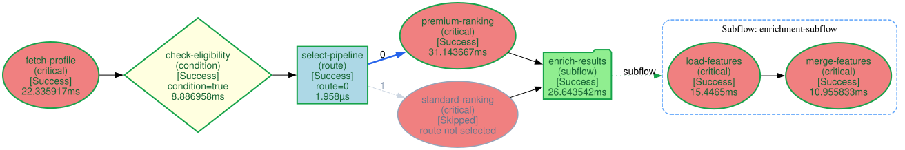
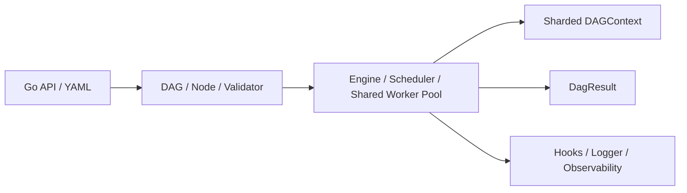

<p align="center">
  
</p>

<h1 align="center">DagBee</h1>

<p align="center">
  Lightweight in-memory DAG orchestration for Go.
  Bounded concurrency, resilient execution, runtime routing, and dynamic subflows.
</p>

<p align="center">
  
  
</p>

<p align="center">
  <a href="#features">Features</a> |
  <a href="#quick-start">Quick Start</a> |
  <a href="#examples">Examples</a> |
  <a href="#observability">Observability</a> |
  <a href="#documentation">Documentation</a>
</p>

DagBee executes dependency graphs inside a Go process. Independent nodes run
concurrently, dependent nodes run after their prerequisites, and one shared
worker pool bounds concurrency across the root DAG and all nested subflows.

## Features

| Area | Capabilities |
| --- | --- |
| Scheduling | Parallel and serial execution, bounded worker pool, priority scheduling |
| Resilience | DAG and node timeouts, fixed or exponential retries, fallback functions, panic recovery, graceful cancellation |
| Failure control | Critical nodes abort the DAG; non-critical nodes degrade without stopping independent work |
| Runtime flow | Predicate-based node conditions, indexed one-to-many route branches, dynamically generated nested subflows |
| Data sharing | Concurrent sharded `DAGContext` with typed access helpers |
| Configuration | Go functional options and declarative YAML topology |
| Extensibility | Lifecycle hooks and pluggable structured logging |
| Observability | Text topology, static and execution-aware DOT, Chrome Trace, and folded flame graph export |
| Allocation control | Pooled DAG and node results to reduce repeated allocations |

## Installation

```bash
go get github.com/vvvcxjvvv/DagBee@latest
```

DagBee requires Go 1.19 or later.

## Quick Start

```go
package main

import (
	"context"
	"fmt"
	"log"

	dagbee "github.com/vvvcxjvvv/DagBee"
)

func main() {
	d := dagbee.NewDAG("hello", dagbee.WithMaxConcurrency(4))

	must(d.AddNode("load-user", func(_ context.Context, dctx *dagbee.DAGContext) error {
		dctx.Set("user", "Ada")
		return nil
	}))

	must(d.AddNode("load-message", func(_ context.Context, dctx *dagbee.DAGContext) error {
		dctx.Set("message", "hello")
		return nil
	}))

	must(d.AddNode("render", func(_ context.Context, dctx *dagbee.DAGContext) error {
		user, _ := dagbee.GetTyped[string](dctx, "user")
		message, _ := dagbee.GetTyped[string](dctx, "message")
		fmt.Printf("%s, %s\n", message, user)
		return nil
	}, dagbee.NodeWithDependsOn("load-user", "load-message")))

	result := dagbee.NewEngine().Run(context.Background(), d)
	defer dagbee.ReleaseDagResult(result)

	if result.Status != dagbee.StatusSuccess {
		log.Fatal(result.Error)
	}
}

func must(err error) {
	if err != nil {
		log.Fatal(err)
	}
}
```

`load-user` and `load-message` can run in parallel. `render` starts after both
finish. Consume or export the result before calling `ReleaseDagResult`.

## Core API

### Node Options

| Option | Description |
| --- | --- |
| `NodeWithDependsOn(names...)` | Declare upstream dependencies |
| `NodeWithPriority(priority)` | Set ready-queue priority; higher values run first |
| `NodeWithTimeout(timeout)` | Set the per-attempt execution timeout |
| `NodeWithRetry(count, interval)` | Set retry count and base interval |
| `NodeWithRetryStrategy(strategy)` | Use `RetryFixed` or `RetryExponential` |
| `NodeWithCritical(critical)` | Abort the DAG on failure when `true` |
| `NodeWithFallback(fn)` | Run a fallback after all attempts fail |
| `NodeWithCondition(fn)` | Skip this node when the predicate returns `false` |
| `NodeWithRoute(fn, routeMap)` | Select one route index; each index may activate multiple downstream nodes |
| `NodeWithSubflow(fn)` | Generate and execute a child DAG at runtime |

### DAG Options

| Option | Description |
| --- | --- |
| `WithMaxConcurrency(n)` | Set the maximum number of active workers; defaults to `runtime.NumCPU()` |
| `WithTimeout(timeout)` | Set the overall DAG timeout |
| `WithHook(hook)` | Register a lifecycle hook |
| `WithLogger(logger)` | Set the DAG logger |

### Engine Options

| Option | Description |
| --- | --- |
| `EngineWithLogger(logger)` | Set the engine logger |
| `EngineWithDAGContextShards(n)` | Set context lock partitions; defaults to `runtime.NumCPU()*4`, rounded to a power of two |
| `EngineWithMaxSubflowDepth(n)` | Set the maximum subflow nesting depth; defaults to `10` |

## Runtime Flow

### Conditions and Routes

Conditions gate the node on which they are configured. Routes run their node,
then select downstream branches by index. A route index can activate multiple
branches.

```go
must(d.AddNode("select-plan", selectPlan,
	dagbee.NodeWithRoute(
		func(dctx *dagbee.DAGContext) int {
			premium, _ := dagbee.GetTyped[bool](dctx, "premium")
			if premium {
				return 0
			}
			return 1
		},
		map[int][]string{
			0: {"premium-rank", "premium-offers"},
			1: {"standard-rank"},
		},
	),
))
```

Every routed downstream node must also declare the route node through
`NodeWithDependsOn`. `NodeWithCondition` and `NodeWithRoute` are mutually
exclusive on the same node.

### Dynamic Subflows

A subflow builds its child DAG at runtime. Parent and child DAGs share the same
`DAGContext` and worker pool, so the concurrency limit applies to the full
execution tree.

```go
must(d.AddNode("recall", nil,
	dagbee.NodeWithDependsOn("prepare"),
	dagbee.NodeWithSubflow(func(
		_ context.Context,
		dctx *dagbee.DAGContext,
	) (*dagbee.DAG, error) {
		partitions, _ := dagbee.GetTyped[int](dctx, "partitions")
		sub := dagbee.NewDAG("recall-partitions")

		for i := 0; i < partitions; i++ {
			name := fmt.Sprintf("partition-%d", i)
			must(sub.AddNode(name, recallPartition(i)))
		}
		return sub, nil
	}),
))
```

See [the complete subflow example](examples/subflow/main.go) and
[the subflow design](docs/subflow-design.md).

## YAML Configuration

YAML defines topology and node settings. Executable functions remain registered
in Go.

```yaml
dag:
  name: recommendation
  max_concurrency: 8
  timeout: 5s
  nodes:
    - name: recall
      timeout: 200ms
      retry: {count: 2, interval: 50ms, strategy: fixed}
      priority: 10
      critical: true
    - name: rank
      depends_on: [recall]
```

```go
registry := map[string]dagbee.NodeFunc{
	"recall": recall,
	"rank":   rank,
}

d, err := dagbee.LoadDAGFromYAML("pipeline.yaml", registry)
```

See the [recommendation pipeline](examples/recommend/pipeline.yaml) for a full
configuration. Runtime-generated subflows are configured in Go through
`NodeWithSubflow`.

## Observability

DagBee provides four topology and execution views:

| Export | API | Purpose |
| --- | --- | --- |
| Text layers | `DAG.Visualize()` | Quick terminal inspection |
| Static Graphviz | `DAG.ExportDOT()` | Topology before execution |
| Execution Graphviz | `DagResult.ExportDOT()` | Status, condition results, selected routes, and expanded runtime subflows |
| Chrome Trace | `DagResult.ExportChromeTrace()` | Perfetto timeline and per-node timing |
| Flame graph data | `DagResult.ExportFlamegraph()` | Folded stacks for slow-path analysis |

Run the observability example:

```bash
go run ./examples/observability
```

It writes all output under `examples/observability/`.

### Graphviz

```bash
dot -Tsvg examples/observability/dag.dot \
  -o examples/observability/dag.svg

# macOS
open examples/observability/dag.svg

# Linux
xdg-open examples/observability/dag.svg
```

The execution-aware graph includes condition outcomes, selected and skipped
route edges, node status and duration, and nested subflow clusters.

<p align="center">
  
</p>

### Chrome Trace

Open [Perfetto](https://ui.perfetto.dev/), choose **Open trace file**, and select
`examples/observability/trace.json`. Chrome-based browsers can also use
`chrome://tracing`.

### Flame Graph

```bash
git clone --depth 1 https://github.com/brendangregg/FlameGraph.git /tmp/FlameGraph

/tmp/FlameGraph/flamegraph.pl \
  --title "DagBee Execution Flame Graph" \
  --countname "microseconds" \
  examples/observability/flamegraph.folded \
  > examples/observability/flamegraph.svg

# macOS
open examples/observability/flamegraph.svg

# Linux
xdg-open examples/observability/flamegraph.svg
```

Wider frames represent more total execution time. Nested frames represent
subflow paths; hover for duration and click to zoom.

Export execution data before releasing its pooled result:

```go
result := engine.Run(ctx, d)
defer dagbee.ReleaseDagResult(result)

executionDOT := result.ExportDOT()
traceJSON, err := result.ExportChromeTrace()
flamegraphData := result.ExportFlamegraph()
```

## Architecture



The engine validates the graph, schedules ready nodes by priority, and runs them
through a fixed-size worker pool. Dynamic subflows reuse that pool instead of
creating a separate concurrency domain.

## Examples

| Example | Description | Run |
| --- | --- | --- |
| [Simple](examples/simple/main.go) | Parallel inputs followed by a dependent merge | `go run ./examples/simple` |
| [MapReduce](examples/mapreduce/main.go) | Split, map, shuffle, reduce, and merge | `go run ./examples/mapreduce` |
| [Subflow](examples/subflow/main.go) | Runtime-generated child DAG | `go run ./examples/subflow` |
| [Observability](examples/observability/main.go) | DOT, Chrome Trace, and flame graph exports | `go run ./examples/observability` |
| [Recommendation](examples/recommend/main.go) | YAML-driven recommendation pipeline | `go run ./examples/recommend` |

## Development

Run tests and the race detector:

```bash
go test ./...
go test -race ./...
```

Run benchmarks:

```bash
go test -run '^$' -bench . -benchmem ./...
```

Focused pressure benchmarks cover wide and deep DAGs, fan-out/fan-in,
retry amplification, concurrent requests, and hot-key versus distinct-key
`DAGContext` contention.

```bash
go test -run '^$' \
  -bench 'BenchmarkEngineRun_(WideDAG|DeepDAG|FanOutFanIn|RetryAmplification|ParallelRequests)$' \
  -benchmem ./...

go test -run '^$' \
  -bench 'BenchmarkDAGContext_(HotKeyContention|DistinctKeyContention)$' \
  -benchmem ./...
```

## License

MIT
