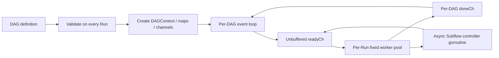
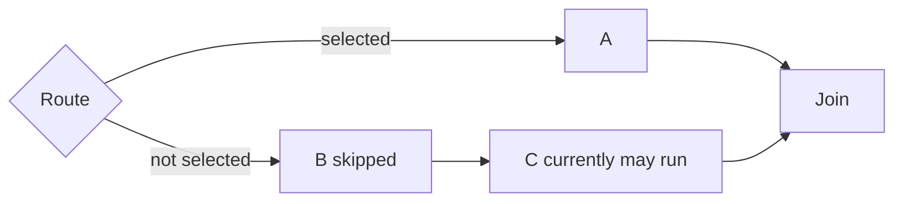
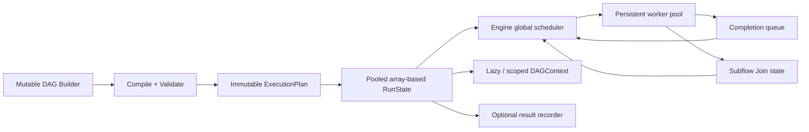

# DagBee 当前风险与性能优化方案

> 基线日期：2026-08-02  
> 代码基线：当前工作区实现  
> 对比对象：`noneback/go-taskflow` v1.2.0  
> 目标：先修复正确性和线上风险，再优化宽图、Fan-out/Fan-in 与 Subflow 的调度成本。

## 1. 结论摘要

当前 DagBee 的总体方向没有根本错误：它比 go-taskflow 提供了更完整的业务编排语义，包括 `context`、错误返回、重试、Fallback、Critical、运行结果、动态路由和 Subflow。但是当前实现仍存在以下问题：

- **2 个 P0 正确性缺陷**：用户回调 panic 可能击穿进程；Route 未选中分支的深层节点可能被错误执行。
- **5 个 P1 线上风险**：超时只能协作取消、子图配置静默失效、Hook 继承会修改 DAG、Subflow 控制 goroutine 无上限、共享 `DAGContext` 无业务隔离。
- **多个 P2 架构和性能问题**：每次运行重复 Validate 和创建 Worker Pool，运行态大量使用字符串 map，单事件循环串行收发，结果与时间记录不可关闭。
- 同 Go 1.24.3、同机器、同测试二进制的空节点基准中，go-taskflow 在宽图、Fan-out/Fan-in 和 Subflow 上快约 **2.0-2.5 倍**；DagBee 在深链上快约 **1.4-1.8 倍**。
- 性能倍数主要来自空节点放大框架开销。512 节点宽图中，DagBee 与 go-taskflow 的实际差距约为 **0.82 微秒/节点**，不能直接推导真实 I/O 业务会慢 2 倍。

优化顺序必须是：

1. 修复 panic 边界和 Route 正确性。
2. 明确 Timeout、Subflow 配置和 Hook 生命周期语义。
3. 引入编译态执行计划、节点整数 ID、运行态对象复用和延迟分配。
4. 最后再考虑 Engine 级共享 Worker Pool 与全局调度器重构。

## 2. 当前执行架构



当前模型的优点是节点并发度始终受根 DAG Worker Pool 限制，Subflow 不同步占用 Worker 等待子图完成。主要问题是每层 DAG 都有独立事件循环和运行态对象，跨层调度没有统一计划与统一优先级。

## 3. 风险分级

| ID | 级别 | 风险 | 主要影响 |
| --- | --- | --- | --- |
| R1 | P0 | Condition 和 Hook panic 未完整捕获 | 用户回调可导致进程崩溃 |
| R2 | P0 | Route 只对直接后继做分支选择 | 未选中分支的深层节点可能执行，产生错误业务结果 |
| R3 | P1 | Timeout 仅传递取消信号 | 不响应 `ctx` 的节点会永久占用 Worker，`Run` 无法返回 |
| R4 | P1 | 子 DAG 的局部并发与 Logger 配置被忽略 | API 配置与实际行为不一致 |
| R5 | P1 | Hook 继承修改子 DAG 的 HookChain | 重复回调、内存增长和并发数据竞争 |
| R6 | P1 | Subflow 控制 goroutine 无全局上限 | 宽 Subflow 场景产生大量 goroutine、channel 和 map |
| R7 | P1 | 父子图共享无命名空间的 DAGContext | 同 key 最后写入覆盖，业务数据互相污染 |
| R8 | P2 | DAG 运行期间未冻结 | 并发修改拓扑可能触发 map 数据竞争或执行不一致 |
| R9 | P2 | 优先级只在单层 DAG 内有效 | 多个 Subflow 竞争 Worker 时不保证全局优先级 |
| R10 | P2 | DagResult 需要调用方手动释放 | 忘记释放、重复释放、释放后读取都可能造成问题 |

P0 表示必须先修复才能将相关能力定义为生产级；P1 表示需要明确约束或提供保护机制；P2 表示不一定立即导致错误，但会限制可维护性和性能上限。

## 4. 正确性与线上风险分析

### 4.1 R1：用户回调 panic 边界不完整

当前普通 `NodeFunc` 和 `SubflowFn` 有局部 recovery，但以下调用位于完整 recovery 边界之外：

- `Hook.BeforeNode`
- `ConditionFn`
- `Hook.OnNodeSkip`
- `Hook.AfterNode`
- `Hook.OnDAGComplete`

相关代码：[`engine.go`](../engine.go#L352)、[`hook.go`](../hook.go#L23)。

`ConditionFn` 在 Worker goroutine 中 panic 时，`workerPool.worker` 没有最外层 recovery，panic 会终止整个 Go 进程。`AfterNode` 在 deferred finalize 中再次 panic 时，也会逃逸已有 recovery。

#### 方案对比

| 方案 | 优点 | 缺点 |
| --- | --- | --- |
| 仅在 Worker 最外层 recovery | 能保证进程不崩溃，改动小 | 无法准确区分是 Condition、Hook 还是 NodeFn 失败 |
| 每类用户回调使用 `safeInvoke` | 错误类型和节点归属清晰，可观测性完整 | 调用点较多，需要统一错误模型 |
| 禁止 Hook/Condition panic，仅写文档 | 零实现成本 | 无法满足框架的 panic recovery 承诺 |

#### 建议

采用双层保护：

1. 每类用户回调通过统一 `safeInvoke` 执行并生成 `PanicError`。
2. Worker goroutine 最外层增加兜底 recovery，防止遗漏的新回调击穿进程。
3. Hook panic 默认标记当前节点失败；`OnDAGComplete` panic 记录到 DAG 结果的 HookError，不覆盖原始业务错误。

### 4.2 R2：Route 深层传播语义错误

当前 Route 处理逻辑位于 [`engine.go`](../engine.go#L230)。未选中的直接后继会被标记为 `Skipped`，随后代码递减该节点下游的 pending。当下游只有这个依赖时，它会被加入就绪队列。



期望行为是 `B` 和分支内部的 `C` 都不执行，但 Join 应在选中分支完成、未选中分支被确认失活后继续。当前 pending 模型无法区分“分支内部节点”和“汇合节点”。

同时，`Validate` 只检查 `RouteMap` 中的节点是否存在，没有检查它是否真的是 Route 节点的直接后继；RouteFn 返回未配置索引时也没有显式错误。

#### 方案对比

| 方案 | 优点 | 缺点 |
| --- | --- | --- |
| 规定 Route 只控制直接后继 | 实现不变 | 不能表达完整 if/else 分支，容易误用 |
| 递归把所有下游标记 Skipped | 实现相对简单 | 会错误跳过多分支 Join |
| 引入入边状态与路径激活标记 | 能正确处理深层分支和 Join | 调度状态模型需要重构 |

#### 建议

选择入边状态模型。每条入边在运行时有 `pending/active/inactive/completed` 状态：

- 选中的 Route 边变为 active。
- 未选中的 Route 边变为 inactive。
- 节点只有在所有入边已解析且至少存在一条 active 路径时才执行。
- 没有 active 路径的节点标记 Skipped，并继续向下游传播 inactive。
- Join 在所有入边已解析且至少一个选中分支提供 active 输入时执行。
- Condition 的节点级门控需要使用不同的完成类型，保持“只跳过自己、下游继续”的现有语义。

必须补充直接边校验、未知 RouteIndex 策略以及多 Route 汇合测试。

### 4.3 R3：Timeout 只能协作取消

[`executeAttempt`](../engine.go#L553) 创建 `context.WithTimeout` 后仍同步调用 `NodeFunc`。Go 无法安全终止任意 goroutine，因此节点忽略 `ctx` 时，超时只能使 `ctx.Done()` 就绪，不能回收 Worker。

把 NodeFunc 放到临时 goroutine 并在超时后提前返回并不等于解决问题：无法停止的 goroutine 会泄漏，而且可能在 DAG 已结束后继续写 `DAGContext`。

#### 建议

- 文档和 API 明确使用“协作式超时”术语。
- 内置 RPC/HTTP 示例必须使用传入的 `ctx`。
- 增加节点超时、取消后仍未返回的 watchdog 指标和日志。
- SubflowFn 必须被约束为短耗时构图函数，不允许执行阻塞 I/O。
- 真正需要强制终止的任务必须放到独立进程、容器或远程 Worker 中执行，不能依赖 goroutine 强杀。

### 4.4 R4：子 DAG 配置静默失效

Worker Pool 只在根 DAG 的 [`Engine.Run`](../engine.go#L67) 中创建。子 DAG 的 `WithMaxConcurrency` 不参与调度，子 DAG 自己的 Logger 也不会被选择。这会造成 API 看起来支持、运行时却无效果。

#### 建议

- 根 Engine 提供全局 Worker 上限。
- 每个 Run 和 Subflow 可以配置局部 quota，但不能超过全局上限。
- `execTask` 携带所属 Run/Subflow quota，调度器派发前获取局部许可。
- 在局部 quota 实现前，显式拒绝或警告子 DAG 上不生效的选项，不能静默忽略。
- 明确 Logger 和 Hook 的继承、覆盖顺序。

### 4.5 R5：Hook 继承和生命周期不完整

[`executeDAG`](../engine.go#L121) 会把父 Hook 直接追加到子 DAG 的 `HookChain`。当 SubflowFn 返回复用的 DAG 时，每次执行都会重复追加；并发运行时还可能与 Hook 遍历产生 slice 数据竞争。

此外，`OnDAGComplete` 只在根 DAG 的 [`Engine.Run`](../engine.go#L80) 调用，子 DAG 没有对应完成事件。

#### 建议

- DAG 定义中的 HookChain 保持不可变。
- 每次执行创建只读 Hook 快照，使用父链引用而不是复制和修改子 DAG。
- 增加 `InheritHooks` 配置，默认继承但不重复注册。
- 每层 DAG 都触发一次 `OnDAGComplete`，事件包含 `depth`、父 Subflow 节点和完整路径。

### 4.6 R6：Subflow 控制 goroutine 无全局上限

异步 Subflow 解决了 Worker 阻塞死锁，但每个活动 Subflow 都创建一个池外 goroutine，并分配自己的 event loop、doneCh、pending map、started map 和调度堆。最大深度限制不能限制同一层的宽度。

#### 建议

- 短期增加 `EngineWithMaxActiveSubflows(n)`，构图完成后异步等待控制器许可。
- 中期复用 Subflow 运行态对象，减少 channel 和 map 分配。
- 长期把子图任务和 Join 状态纳入统一全局调度器，不再为每个子图创建完整事件循环。

### 4.7 R7：DAGContext 线程安全但没有业务隔离

分片锁能避免并发 map 写崩溃，但相同 key 仍是 last-write-wins。并行 Subflow 使用相同 key 时会出现业务覆盖。

#### 建议

提供轻量 scoped facade：

```go
childContext := dctx.Scope("subflow-name")
childContext.Set("result", value) // physical key: subflow-name.result
```

默认继续共享根 Context，保证兼容性；Subflow 可选择私有命名空间，并通过显式 `Parent()` 或导出 key 与父图交换数据。

## 5. 性能对比基线

### 5.1 测试口径

基准代码：[`benchmarks/comparison/comparison_test.go`](../benchmarks/comparison/comparison_test.go)。

- CPU：Apple M1 Pro，10 logical CPUs。
- OS：darwin/arm64。
- 编译器：Go 1.24.3。
- go-taskflow：v1.2.0。
- DagBee 和 go-taskflow 被编译到同一个 benchmark 二进制，使用完全相同的 Go 编译器。
- 两边预先构建拓扑，使用 `runtime.NumCPU()` 作为并发度。
- 节点函数为空，用于放大框架执行开销。
- 计时包含公开 API 的执行、调度、完成和清理；不包含拓扑构建。
- DagBee 的 `ReleaseDagResult` 被计入，因为它是当前公开 API 生命周期的一部分。
- 采样参数：`-benchtime=1s -count=3`，表格取三次中位数。

### 5.2 测试结果

| Topology | Size | DagBee | go-taskflow | Lower ns/op |
| --- | ---: | ---: | ---: | --- |
| Wide | 32 nodes | 48.3 us/op | 19.9 us/op | go-taskflow, 2.4x |
| Wide | 128 nodes | 193.7 us/op | 78.6 us/op | go-taskflow, 2.5x |
| Wide | 512 nodes | 839.1 us/op | 416.9 us/op | go-taskflow, 2.0x |
| Deep | 32 nodes | 46.3 us/op | 67.2 us/op | DagBee, 1.4x |
| Deep | 128 nodes | 158.6 us/op | 276.2 us/op | DagBee, 1.7x |
| Deep | 512 nodes | 620.1 us/op | 1,096.4 us/op | DagBee, 1.8x |
| Fan-out/fan-in | 16 branches | 32.7 us/op | 14.9 us/op | go-taskflow, 2.2x |
| Fan-out/fan-in | 64 branches | 106.4 us/op | 44.3 us/op | go-taskflow, 2.4x |
| Fan-out/fan-in | 256 branches | 496.9 us/op | 222.1 us/op | go-taskflow, 2.2x |
| Subflow | 3 child nodes | 20.2 us/op | 9.0 us/op | go-taskflow, 2.2x |

这些数据衡量的是“公开 API 的完整执行成本”，不是等价内部调度原语。DagBee 默认提供更多语义，因此不能只根据单个倍数判断框架质量。

### 5.3 Profile 结论

512 节点宽图和深链的 CPU profile 热点主要位于：

- `runtime.pthread_cond_signal`
- `runtime.pthread_cond_wait`
- `runtime.schedule`
- `runtime.selectgo`
- channel 收发、goroutine park/unpark 和 work stealing

说明主要成本来自调度同步和 goroutine 唤醒，而不是空节点函数本身。

## 6. 性能差异根因

### 6.1 宽图和 Fan-out/Fan-in

DagBee 每次运行额外承担：

1. 完整 DAG Validate 和 Kahn 拓扑检查。
2. 创建分片 `DAGContext`。当前机器默认 64 个 shard，每个 shard 立即创建 map。
3. 创建并关闭固定数量 Worker goroutine。
4. 创建 pending、started、doneCh、优先级堆和结果状态。
5. 通过单事件循环和无缓冲 readyCh 串行派发所有任务。
6. 每节点记录开始/结束时间、状态、错误、重试、路由和 SubflowResult。
7. 完成后清理并归还 DagResult/NodeResult 对象池。

go-taskflow 的节点是 `func()`，默认没有 context、error、重试、Fallback 和结果树，也没有每次完整 Validate，因此宽图热路径更短。

### 6.2 深链

深链一次只有一个节点就绪。DagBee 的事件循环完成节点后直接递减一个下游 pending 并派发下一个节点。

go-taskflow 每步需要处理节点锁、原子 join counter、全局队列锁、`sync.Cond` 唤醒、WaitGroup 和节点状态复位。同步固定成本按节点线性累积，因此 DagBee 在深链上更快。

### 6.3 Subflow

当前 Subflow 对比存在明确语义差异：

- DagBee 每次执行都重新调用 SubflowFn、构建子 DAG、Validate、创建子运行态和结果树。
- go-taskflow 第一次执行后保留已实例化子图，后续直接复用。

因此当前数据体现的是“动态 Subflow 完整能力成本”，不是纯子图调度器性能。

### 6.4 内存与分配

DagBee 在各场景中通常有更高 `B/op`，原因是运行态 map、Context shard 和结果结构较大；在大节点场景中 DagBee 的 `allocs/op` 反而可能低于 go-taskflow，说明对象池减少了小对象数量，但没有降低总字节量。

结论：不能只优化对象数量，还需要减少运行态结构总量和 map/string 成本。

## 7. 性能优化方案对比

| 优化方向 | 主要收益 | 复杂度 | 风险 | 建议优先级 |
| --- | --- | --- | --- | --- |
| 编译态 ExecutionPlan 与 Validate 缓存 | 删除每次 Kahn 校验和字符串拓扑解析 | 中 | DAG 变更后的缓存失效 | P0 性能 |
| 节点整数 ID + 数组运行态 | 降低 map、hash、指针和原子分配 | 中高 | 需要稳定映射和调试名称反查 | P0 性能 |
| DAGContext shard 延迟初始化 | 空 Context 场景减少约 64 个 map 创建 | 低 | 首次 Set 路径多一次初始化判断 | P0 性能 |
| 复用 pending/started/scheduler 状态 | 降低 B/op 和 GC 压力 | 中 | Reset 不完整会污染下一次运行 | P1 性能 |
| Engine 级持久 Worker Pool | 删除每次 Worker 创建、关闭和唤醒成本 | 高 | 多 Run 公平性、局部并发额度 | P1 性能 |
| 可选 Result/Timing 级别 | 空任务与无需观测请求显著降耗 | 中 | API 语义和默认行为选择 | P1 性能 |
| 批量派发与批量完成处理 | 降低宽图 channel/select 次数 | 中高 | 优先级、公平性和取消延迟 | P1 性能 |
| 静态 Subflow API/计划缓存 | 避免重复构图与 Validate | 中 | 必须区分静态和真正动态子图 | P1 性能 |
| 全局调度器统一父子图任务 | 消除 per-Subflow event loop，支持全局优先级 | 高 | 核心架构重构 | P2 性能 |
| Per-worker work-stealing queue | 改善极端细粒度 CPU 任务吞吐 | 很高 | Go 下收益不一定覆盖复杂度 | 暂缓 |

### 7.1 编译态 ExecutionPlan

建议增加显式或自动编译阶段：

```go
plan, err := dag.Compile()
result := engine.RunPlan(ctx, plan)
```

ExecutionPlan 保存：

- 稳定节点整数 ID 与名称反查表。
- 初始入度数组。
- 下游 ID 数组。
- Route 边和普通边的编译态索引。
- Entry 节点列表。
- 拓扑版本号与校验结果。

`AddNode` 修改 DAG 时递增 revision 并使缓存失效。运行开始后 DAG 应冻结或使用不可变 plan，解决 R8 的并发修改风险。

### 7.2 数组化运行状态

将当前热路径结构：

```text
map[string]*int32 pending
map[string]bool started
map[string]*NodeResult results
```

改为：

```text
[]int32 pending
[]uint8 state
[]*NodeResult results
```

名称只在 API 返回、日志和导出阶段转换。当前 pending 只由单事件循环修改时不需要 atomic；如果后续改为并行传播，再按所有权边界决定是否恢复原子操作。

### 7.3 DAGContext 延迟分配

当前 [`newDAGContextWithShards`](../dagcontext.go#L54) 为每个 shard 立即创建 map。建议：

- `[]*dctxShard` 改为连续的 `[]dctxShard`，减少 shard 对象分配。
- `data` 在第一次 `Set` 时持锁初始化。
- `Get` 读取 nil map 是安全的，不需要提前创建。

该优化风险低，适合作为首个性能改动。

### 7.4 Engine 级共享 Worker Pool

建议将全局 Worker 数从 DAGOption 提升到 EngineOption：

```go
engine := NewEngine(EngineWithMaxWorkers(32))
```

每次 Run 和 Subflow 再声明局部 quota。任务携带 `runID`、`planID`、priority 和 quota，统一进入 Engine ready queue。

共享 Worker Pool 的主要设计约束：

- 一个 Run 不能独占全部 Worker。
- 根 DAG 取消不能影响其他 Run。
- 优先级需要包含局部优先级和跨 Run 公平性。
- Engine.Close 必须等待已接收任务或明确拒绝新 Run。
- 不能让共享 Engine 重新引入 Subflow 同步等待死锁。

### 7.5 Result 与 Timing 模式

DagBee 当前始终生成完整结果和节点时间。建议保持现有默认行为兼容，同时提供：

```go
EngineWithResultMode(ResultFull)
EngineWithResultMode(ResultSummary)
EngineWithResultMode(ResultNone)
```

- `Full`：保持当前 NodeResult、动态 DOT、Trace 和 Flamegraph 能力。
- `Summary`：只记录总体状态、失败节点和聚合计数。
- `None`：仅返回最终 error/status，适合极细粒度内部任务。

关闭时间记录后，执行态 DOT/Trace 不可用，必须通过类型或显式错误体现，不能静默输出空数据。

### 7.6 静态与动态 Subflow 分离

保留 `NodeWithSubflow(SubflowFn)` 表示每次运行动态构图，新增静态形式：

```go
NodeWithStaticSubflow(compiledPlan)
```

静态子图只 Compile 一次；动态子图继续每次 Validate。这样能获得性能收益，同时不破坏动态拓扑语义。

## 8. 目标架构



目标架构的核心不是复制 C++ Taskflow 的无锁队列，而是先消除重复编译、字符串 map、运行态分配和 per-Run Worker 生命周期，再决定是否需要 work-stealing。

## 9. 分阶段落地计划

### 阶段 0：正确性修复

1. 为 Condition、Route、Subflow、Fallback、Hook 和 Worker 增加完整 panic 边界。
2. 重构 Route 为入边状态与路径激活模型。
3. 校验 RouteMap 目标必须是直接后继，定义未知 RouteIndex 行为。
4. 增加深层未选中分支、多层 Join、多 Route 汇合和 callback panic 测试。

### 阶段 1：语义和资源边界

1. 明确 Timeout 为协作式取消，增加 stuck-node watchdog。
2. 定义根/子 DAG 并发 quota、Logger 和 Hook 继承规则。
3. HookChain 改为不可变执行快照，每层触发 `OnDAGComplete`。
4. 增加最大活动 Subflow 数。
5. 提供可选 scoped DAGContext。
6. DAG Compile 后冻结，运行期间禁止修改。

### 阶段 2：低风险性能优化

1. 引入 ExecutionPlan 和 Validate 缓存。
2. 节点 ID 化，pending/started/results 数组化。
3. DAGContext shard 和 map 延迟初始化。
4. 使用 sync.Pool 复用内部 RunState，但不池化调用方可能继续持有的对象。
5. 增加 ResultMode，保留 `Full` 默认值保证兼容。
6. 增加静态 Subflow 编译缓存。

### 阶段 3：调度器重构

1. Engine 级持久 Worker Pool。
2. 全局 ready/completion queue 和 per-Run quota。
3. 父子图统一 Join 状态，减少 per-Subflow event loop。
4. 支持跨层全局优先级和多 Run 公平调度。
5. 宽图批量派发、批量完成和取消检查。

### 阶段 4：评估高级调度

完成前三阶段并重新 profile 后，再决定是否实现 per-worker local queue 或 work stealing。若热点仍主要在全局队列锁和 goroutine 唤醒，且真实业务任务足够细粒度，才有引入复杂调度结构的必要。

## 10. 验收标准

### 10.1 正确性

| 验收项 | 标准 |
| --- | --- |
| 用户回调 panic | Condition、Hook、Route、Fallback、Subflow 均不能击穿进程 |
| Route 深层分支 | 未选中分支所有内部节点不执行，Join 正确执行 |
| Route 校验 | 非直接后继和未知 index 有明确错误或显式默认策略 |
| Hook 继承 | 复用子 DAG 连续运行不会重复注册，并发运行 `-race` 无告警 |
| 子 DAG 配置 | 所有公开 Option 要么生效，要么 Validate 明确拒绝 |
| Timeout | 文档、日志和测试明确为协作式取消，不承诺 goroutine 强杀 |
| 并发修改 | 已 Compile/运行的 DAG 不允许继续修改 |

### 10.2 性能

以下目标使用与基线完全相同的 Apple M1 Pro、Go 1.24.3 和 benchmark 命令，不作为跨机器 SLA：

| Benchmark | 当前基线 | 阶段 2 目标 | 约束 |
| --- | ---: | ---: | --- |
| Wide 512 | 839 us/op | <= 650 us/op | Deep 512 不回退超过 10% |
| Fan-out/fan-in 256 | 497 us/op | <= 350 us/op | Route 正确性测试全部通过 |
| Deep 512 | 620 us/op | <= 680 us/op | 保持 DagBee 当前优势 |
| Dynamic Subflow | 20.2 us/op | <= 18 us/op | 每次动态构图语义不变 |
| Static Subflow | 当前无 API | <= 13 us/op | 使用预编译计划 |

同时要求：

- Wide 512 的 `B/op` 至少下降 20%。
- 根模块 `go test ./...`、`go test -race ./...` 全部通过。
- 基准至少 `-count=5`，使用 benchstat 比较，不采信单次结果。
- 性能优化不能关闭默认错误、取消和完整结果语义；轻量模式必须显式启用。

## 11. 非目标

- 不尝试在 Go 进程内强制杀死忽略 context 的 goroutine。
- 不为了追平空任务基准删除默认错误治理能力。
- 不在当前阶段支持有环工作流。
- 不直接照搬 C++ Taskflow 的无锁 BWSQ；先根据 Go runtime profile 决定是否需要。
- 不把 go-taskflow 的 Subflow 复用结果与 DagBee 动态构图成本视为完全等价指标。

## 12. 验证命令

主模块：

```bash
go test ./...
go test -race ./...
```

同版本 Go 的框架对比：

```bash
cd benchmarks/comparison
go version
go test -run '^$' -bench '^BenchmarkComparison$' -benchmem -benchtime=1s -count=5
```

CPU profile：

```bash
go test -run '^$' \
  -bench '^BenchmarkComparison/Wide/N512/DagBee$' \
  -benchtime=5s \
  -cpuprofile=dagbee-wide.cpu

go tool pprof -top comparison.test dagbee-wide.cpu
```

详细的基准实现和原始口径见 [`benchmarks/comparison/README.md`](../benchmarks/comparison/README.md)。
